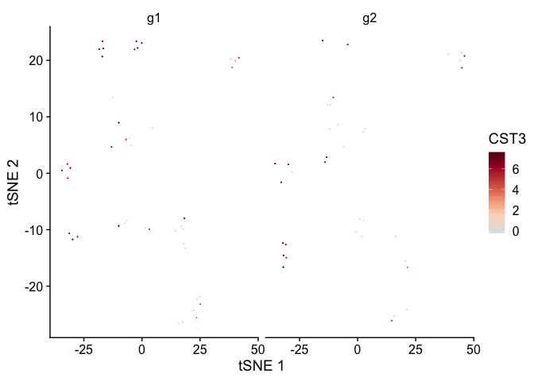

<!-- README.md is generated from README.Rmd. Please edit that file -->

# scbp

<!-- badges: start -->

<!-- badges: end -->

scbp is boilerplate code for single cell analyses. Mostly thin wrappers
on seurat functions.

## Installation

``` r
remotes::install_github(rnabioco/scbp)
```

## Example

``` r
library(scbp)
library(Seurat)

so <- Seurat::pbmc_small

plot_tsne(so, "groups")
```


``` r
plot_tsne(so, "CST3")
```


``` r

plot_features_split(so, 
                    "CST3",
                    "groups", 
                    embedding = "tsne")
```



``` r

plot_features_split(so, 
                    "RNA_snn_res.1",
                    "groups", 
                    embedding = "tsne", 
                    minimal_theme = TRUE,
                    )
```


``` r

get_metadata(so)
#> # A tibble: 80 x 12
#>    cell  orig.ident nCount_RNA nFeature_RNA RNA_snn_res.0.8 letter.idents groups
#>    <chr> <fct>           <dbl>        <int> <fct>           <fct>         <chr> 
#>  1 ATGC… SeuratPro…         70           47 0               A             g2    
#>  2 CATG… SeuratPro…         85           52 0               A             g1    
#>  3 GAAC… SeuratPro…         87           50 1               B             g2    
#>  4 TGAC… SeuratPro…        127           56 0               A             g2    
#>  5 AGTC… SeuratPro…        173           53 0               A             g2    
#>  6 TCTG… SeuratPro…         70           48 0               A             g1    
#>  7 TGGT… SeuratPro…         64           36 0               A             g1    
#>  8 GCAG… SeuratPro…         72           45 0               A             g1    
#>  9 GATA… SeuratPro…         52           36 0               A             g1    
#> 10 AATG… SeuratPro…        100           41 0               A             g1    
#> # … with 70 more rows, and 5 more variables: RNA_snn_res.1 <fct>, PC_1 <dbl>,
#> #   PC_2 <dbl>, tSNE_1 <dbl>, tSNE_2 <dbl>
```
