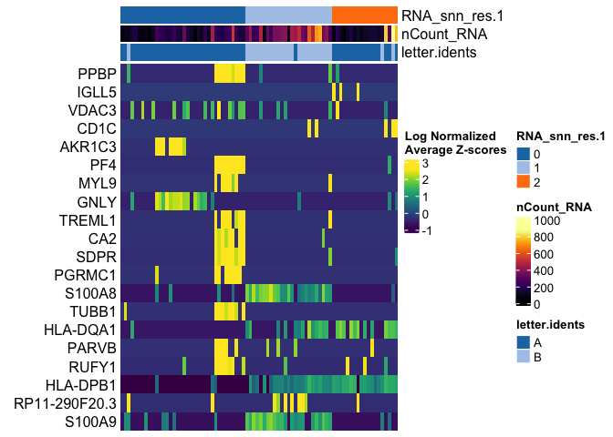
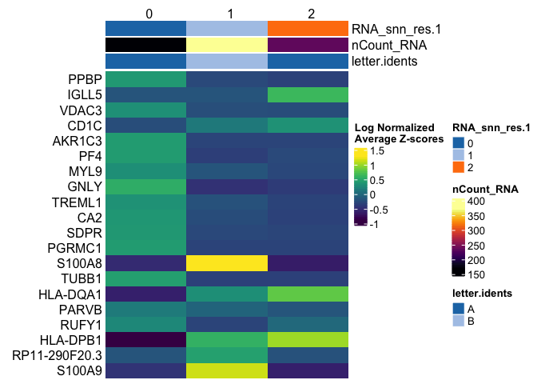

<!-- README.md is generated from README.Rmd. Please edit that file -->

# scbp

<!-- badges: start -->

<!-- badges: end -->

scbp is boilerplate code for single cell analyses. Mostly thin wrappers
on seurat functions.

## Installation

``` r
remotes::install_github("rnabioco/scbp")
```

## plotting

``` r
library(scbp)
library(Seurat)

so <- Seurat::pbmc_small

plot_tsne(so, c("groups", "CST3"))
#> [[1]]
```


    #> 
    #> [[2]]


``` r
plot_tsne(so, c("groups", "CST3"), group = "letter.idents")
#> [[1]]
```


    #> 
    #> [[2]]


Wrappers for common projections:

`plot_feature()` `plot_umap()` `plot_pca()` `plot_tsne()`
`plot_harmony()`

### Summarizing functions

``` r
get_metadata(so)
#> # A tibble: 80 x 12
#>    cell  orig.ident nCount_RNA nFeature_RNA RNA_snn_res.0.8 letter.idents groups
#>    <chr> <fct>           <dbl>        <int> <fct>           <fct>         <chr> 
#>  1 ATGC… SeuratPro…         70           47 0               A             g2    
#>  2 CATG… SeuratPro…         85           52 0               A             g1    
#>  3 GAAC… SeuratPro…         87           50 1               B             g2    
#>  4 TGAC… SeuratPro…        127           56 0               A             g2    
#>  5 AGTC… SeuratPro…        173           53 0               A             g2    
#>  6 TCTG… SeuratPro…         70           48 0               A             g1    
#>  7 TGGT… SeuratPro…         64           36 0               A             g1    
#>  8 GCAG… SeuratPro…         72           45 0               A             g1    
#>  9 GATA… SeuratPro…         52           36 0               A             g1    
#> 10 AATG… SeuratPro…        100           41 0               A             g1    
#> # … with 70 more rows, and 5 more variables: RNA_snn_res.1 <fct>, PC_1 <dbl>,
#> #   PC_2 <dbl>, tSNE_1 <dbl>, tSNE_2 <dbl>
```

``` r
plot_cell_proportions(so, "RNA_snn_res.1", "letter.idents")
```



``` r
so <- calc_diversity(so,
               sample_id = "letter.idents",
               group_id = "RNA_snn_res.1") 

plot_tsne(so, "entropy")
```



## UCSC cellbrowser utils

Wrappers around UCSC cellbrowser generation routines. Uses data.table
fwrite to speed up generating files.

``` r

make_cellbrowser(so, 
                 column_list = c("orig.ident", "groups"),
                 project = "pbmcs",
                 primary_color_palette = RColorbrewer::brewer.pal("Paired"),
                 secondary_color_palette = scbp::palette_OkabeIto,
                 secondary_cols = "groups",
                 outdir = "cell_browser",
                 marker_file = "path/to/presto_or_seurat_marker_file.tsv",
                 ident = "groups",
                 embeddings = c("pca"),
                 config = list(priority = 4,   # options for cellbrowser.conf
                               radius = 5,
                               tags = "10x"),
                 description = list(    # options for summary.html
                   title = "Example cellbrowser",
                   description = "An informative description of this dataset"
)

build_cellbrowser(dataset_paths = "pbmcs/cell_browser/cellbrowser.conf",
                  outdir = file.path(cb_outdir, "pbmc_browser"))
```

## Others

`preprocess_bustools` read in bustools output and process with
`DropletUtils::emptyDrops()`

`plot_bc()` plot barcode distribution generated by
`DropletUtils::barcodeRanks()`
